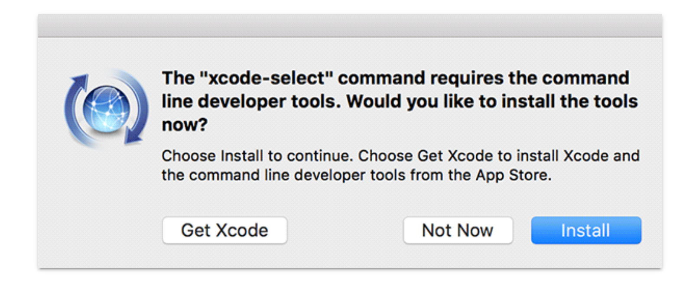

# SETUP

## Command Line Tools
Get the XCode Command Line tools for the C compiler required to install Ruby:
https://www.maketecheasier.com/install-command-line-tools-without-xcode/
(note: at the step where you see this prompt , make sure you **click Install** and **NOT** 'Get XCode', or you will end up installing the whole IDE, which will take a long, long time)

## Package Manager
 Install Homebrew: https://brew.sh/
- Most tutorials/guides/documentation will ask you to install stuff via Homebrew if you're on Mac. Think of it as a one stop place to manage all your installations (instead of dealing with separate installers for separate applications)

## Git
Git may already be preinstalled, but the system version may not always be up to date. You will want to install the latest with Homebrew https://www.atlassian.com/git/tutorials/install-git

## Ruby Installation and Version Management
Install the asdf version manager https://github.com/asdf-vm/asdf
- This is a tool that allows you to install and manage multiple versions of not just Ruby, but other languages (so you don't need a separate version manager for each language you want/need to use)
- Make sure you follow the README instructions and install all the dependencies required on your system (you'll see that it's asking you to install them via Homebrew!)
After you've installed asdf itself, you need to install the Ruby plugin:  https://github.com/asdf-vm/asdf-ruby
- It's as simple as
```
asdf plugin-add ruby https://github.com/asdf-vm/asdf-ruby.git
```
- Now you need to actually install your desired Ruby version. Different versions of Rails depend on different versions of Ruby, as you can see here http://edgeguides.rubyonrails.org/upgrading_ruby_on_rails.html#ruby-versions
- Use asdf list-all ruby to see all the available ruby versions
- **(Before installing anything, I strongly suggest you follow the instructions here** https://github.com/asdf-vm/asdf-ruby#default-gems **to tell asdf–ruby to automatically install a default set of gems every time you install a new Ruby version)**
- Try to install the latest Ruby version, as well the same version as you used for your technical task (check your Gemfile!)
- To see what other commands asdf offers you, just type asdf, and you will see some helpful documentation
- Set your **global** ruby version to one of the one's you installed (probably the latest)

## Installing SQLite3 and PostgreSQL (databases)
We will be using PostgreSQL for the actual app we will be building throughout the bootcamp. Nonetheless, you should try out running your technical task locally (and two of you used SQlite3), so try installing that too
- SQLite3 can be easily installed via Homebrew (there might be an older version preinstalled by default)
- PostgreSQL can also be installed via Homebrew **but we strongly recommended using the Postgres.app instead: https://postgresapp.com/** (it's less hassle)
- Check that your installation worked (open the sqlite3 or psql console and list databases)

## Run your Rails App locally if you haven't already
- You need to set the **local** version of ruby using asdf in your project directory
- If you set up your default-gems file previously, you should already have Bundler installed. Bundler is the tool that helps you manage your gem dependencies for each project. In your project directory run bundler to install your project dependencies
- If any steps fail during installation, read the errors. It may be because connection to the RubyGems server timed out (in which case ensure your internet connection is ok and just try the command again), or you may be missing some system dependecies (which will be suggested in the error logs, along with how to rectify it)
- Set up your database (this should run all migrations and seeds)
Run bin/rails s and view your app in your browser
